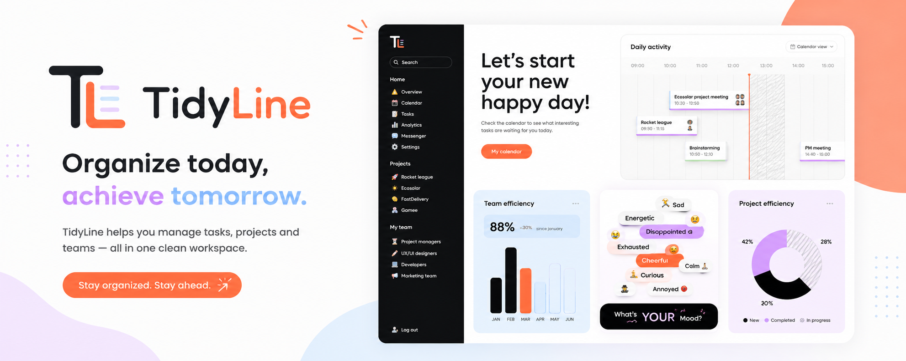
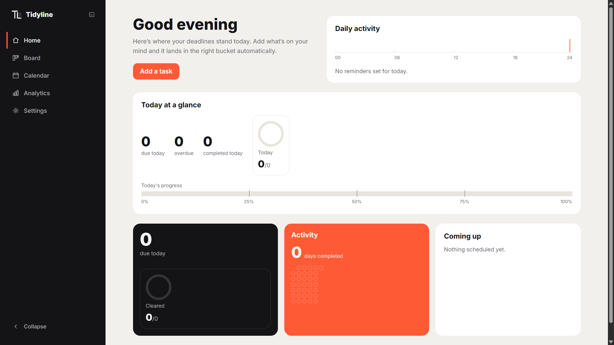

<div align="center">
  

# TidyLine

A deadline-focused task manager that organizes your work by how soon it's due — not by folder, project, or priority you have to set yourself.

</div>

<br />



<br /><br />

## What it does

Add a task with a deadline and TidyLine automatically places it into the right time bucket — Today, This Week, This Month, and beyond — and moves it forward as the deadline approaches. No manual sorting, no projects to set up first. Type a task in plain English ("renew passport next Friday !high #admin remind 1 day before") and TidyLine's quick-add parser pulls out the deadline, priority, tags, and reminder for you.



## Features

**Task management**

- Rich task details — notes, checklists, links, location, and estimated duration
- Quick-add with natural-language parsing (dates, priority, energy level, duration, reminders, recurrence, and tags typed inline)
- Edit, pin, duplicate, archive, and undo destructive actions
- Drag and drop tasks between buckets, calendar dates, or the day planner timeline
- Bulk select and act on multiple tasks at once
- Tags, instant fuzzy search, filtering, sorting, and saved filters
- Task templates that reuse recurring details while leaving the title and deadline blank

**Reminders & recurrence**

- Smart reminder presets (5 min / 30 min / 1 hour before, tomorrow morning, every weekday, custom)
- Recurring tasks — daily, weekly, monthly, yearly, or every N days
- Browser notifications with sound, snooze, and mark-complete-from-notification

**Views**

- Home — a daily-at-a-glance dashboard with today's progress and activity
- Board — the core bucketed task list, grouped Today through Later, with configurable buckets
- Calendar — month view with drag-to-reschedule
- Day planner — drag actionable tasks onto an hour-by-hour timeline and resize blocks to set duration
- Someday / Maybe — a holding area for undated ideas you can promote to the board once they're ready
- Analytics — completion trends, streaks, workload, and bucket breakdowns

**Living timeline & workload awareness**

- Tasks visibly flow toward "Today" as their deadline approaches, with countdown labels and animated bucket transitions
- A deadline-risk score weighs time pressure, estimated effort, checklist progress, and postponements to flag tasks worth attention
- Same-day workload tracking warns when a day is overloaded and offers a redistribution helper
- An end-of-day shutdown review summarizes what got done and rolls unfinished tasks into tomorrow

**Everything else**

- Command palette (`Ctrl+K`) and keyboard shortcuts for common actions
- Light/dark mode, selectable accent color, and compact/comfortable density
- Export and import your tasks as JSON
- All data stored locally in your browser — no account, no backend

## Tech stack

- [React 19](https://react.dev/) + [Vite](https://vite.dev/) for the app and build tooling
- [wouter](https://github.com/molefrog/wouter) for routing
- [chrono-node](https://github.com/wanasit/chrono) for natural-language date parsing in quick-add
- ESLint for linting, plus a set of custom smoke-test and parser-test scripts (no traditional test framework)

## Local development

```bash
npm install
npm run dev
```

Other useful scripts:

```bash
npm run lint    # ESLint
npm run build   # Production build
npm run check   # Lint + build + all smoke/parser tests
```

## Live preview

[tidyline-web.vercel.app](https://tidyline-web.vercel.app/)

## Contributors

- **[bilal-rauf-dev](https://github.com/bilal-rauf-dev)** — Lead
- **[talha-rauf-dev](https://github.com/talha-rauf-dev)**
